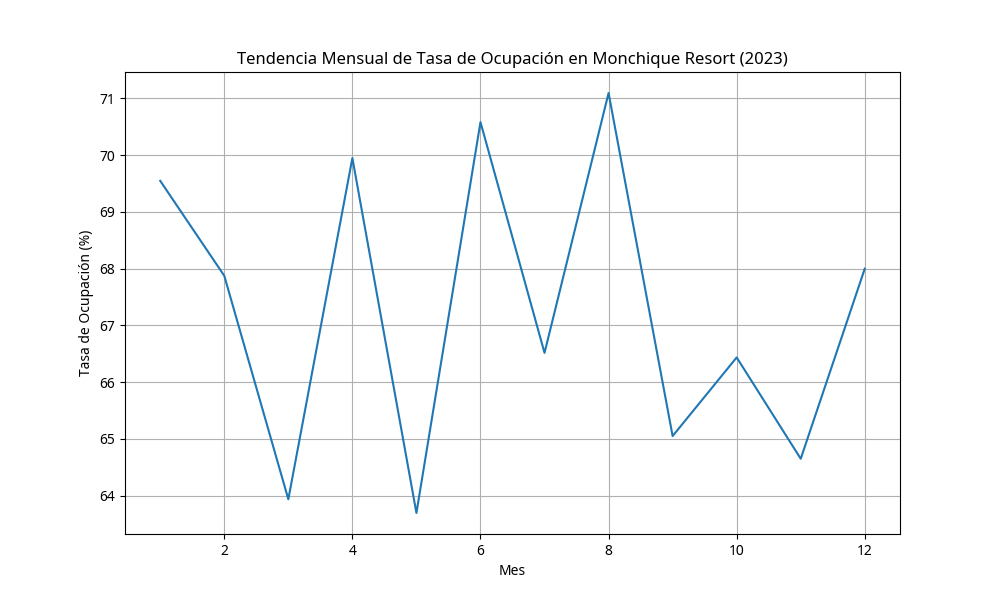
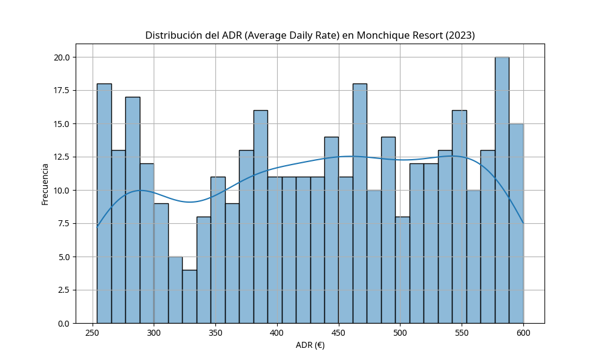
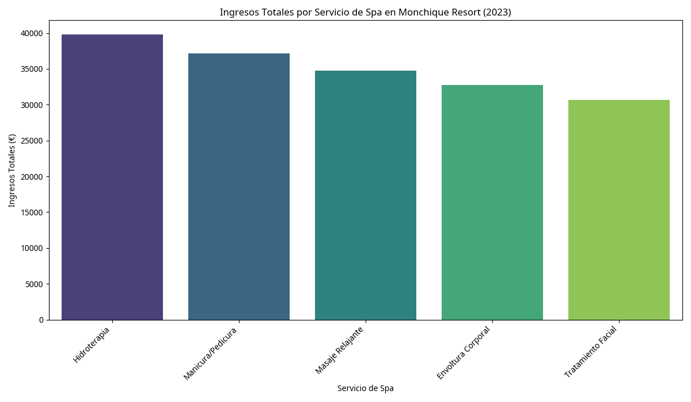
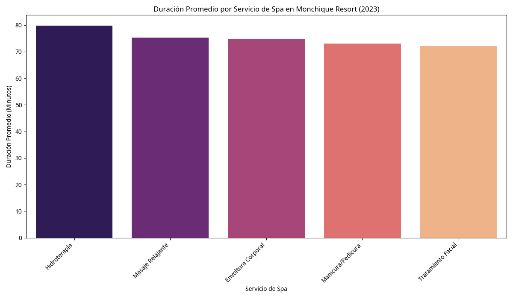
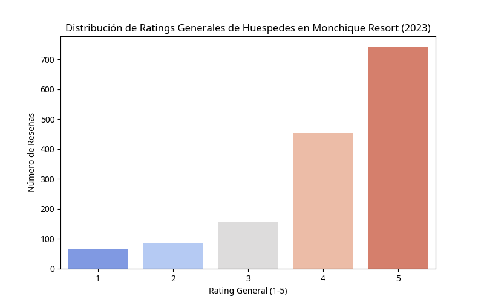
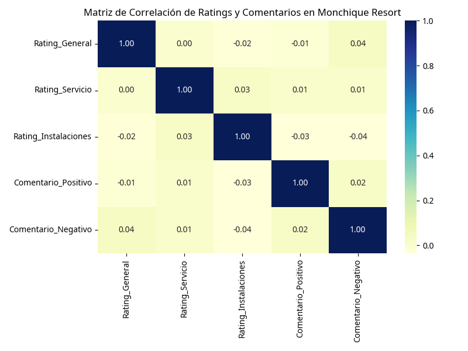

# 🌟 Análisis de Datos para Monchique Resort & Spa: Optimización de Lujo y Experiencia del Cliente

## 🎯 Objetivo del Proyecto

Este proyecto se enfoca en el análisis de datos para el **Monchique Resort & Spa**, un hotel de lujo de 5 estrellas en Monchique, Portugal. El objetivo principal es optimizar la gestión de ingresos, mejorar la experiencia del cliente y maximizar la rentabilidad a través de un análisis profundo de la ocupación hotelera, los servicios de spa y la satisfacción de los huéspedes.

## 📊 Datasets Utilizados (Simulados)

Se han generado datasets simulados para representar:
- **Ocupación y Revenue**: Datos diarios de habitaciones disponibles, ocupadas, ADR (Average Daily Rate) y RevPAR (Revenue per Available Room).
- **Servicios de Spa**: Información sobre los ingresos y la duración de los diferentes servicios de spa.
- **Satisfacción del Cliente**: Ratings generales, de servicio e instalaciones, junto con indicadores de comentarios positivos/negativos.

## 📈 Análisis y Visualizaciones Clave

### 🏨 Ocupación y Revenue Management

#### Tendencia Mensual de Tasa de Ocupación

Este gráfico muestra la evolución de la tasa de ocupación promedio a lo largo de los meses, identificando patrones estacionales y picos de demanda.

#### Distribución del ADR (Average Daily Rate)

Visualización de la distribución del ADR, que ayuda a entender la estrategia de precios y su variabilidad.

### 💆‍♀️ Análisis de Servicios de Spa

#### Ingresos Totales por Servicio de Spa

Gráfico de barras que detalla los ingresos generados por cada tipo de servicio de spa, permitiendo identificar los servicios más rentables.

#### Duración Promedio por Servicio de Spa

Análisis de la duración promedio de cada servicio de spa, útil para la planificación de recursos y la optimización de horarios.

### ⭐ Satisfacción del Cliente

#### Distribución de Ratings Generales de Huéspedes

Este gráfico de barras muestra la frecuencia de cada rating general (1-5 estrellas), indicando el nivel de satisfacción predominante.

#### Matriz de Correlación de Ratings y Comentarios

Mapa de calor que visualiza las correlaciones entre los diferentes tipos de ratings y la presencia de comentarios positivos/negativos, revelando qué aspectos influyen más en la percepción del cliente.

## 🛠️ Tecnologías Utilizadas

- **Python**: Lenguaje principal para el análisis de datos.
- **Pandas**: Manipulación y análisis de datos.
- **Matplotlib & Seaborn**: Creación de visualizaciones estáticas y atractivas.

## 💡 Insights Clave para Reclutadores

- **Habilidad en Revenue Management**: Demuestra capacidad para analizar métricas clave (ADR, RevPAR, Ocupación) y optimizar estrategias de precios.
- **Análisis de Experiencia del Cliente**: Competencia en la interpretación de datos de satisfacción para mejorar servicios y fidelización.
- **Visualización de Datos**: Creación de gráficos claros y concisos que comunican insights complejos de manera efectiva.
- **Pensamiento Analítico**: Capacidad para transformar datos brutos en información accionable para la toma de decisiones estratégicas en el sector hotelero de lujo.
- **Gestión de Datos**: Experiencia en la preparación y limpieza de datos para el análisis.

Este proyecto es un ejemplo de cómo el análisis de datos puede ser aplicado para impulsar el éxito en la industria hotelera de lujo, enfocándose en la optimización de ingresos y la excelencia en el servicio al cliente.

