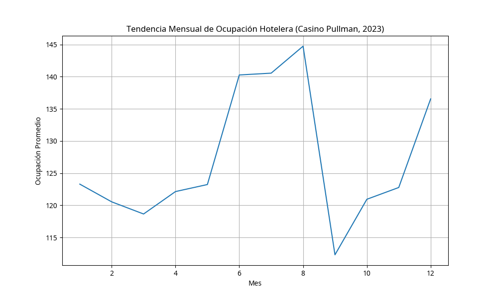
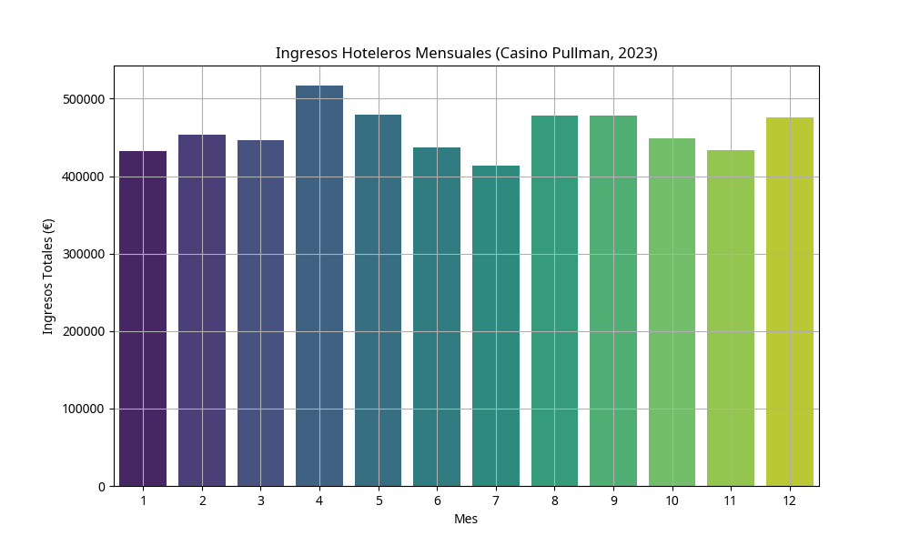
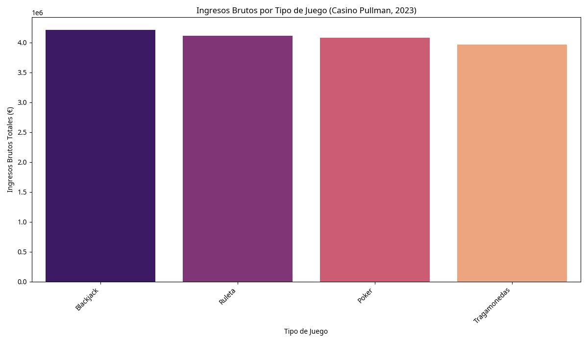
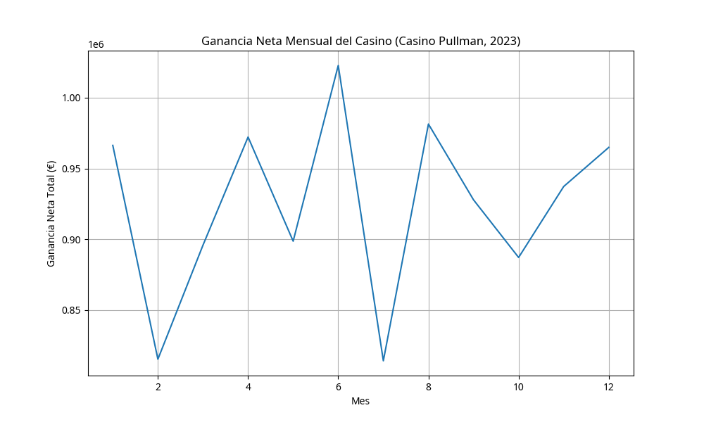
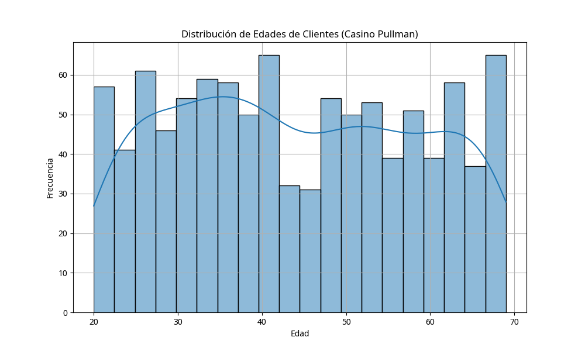
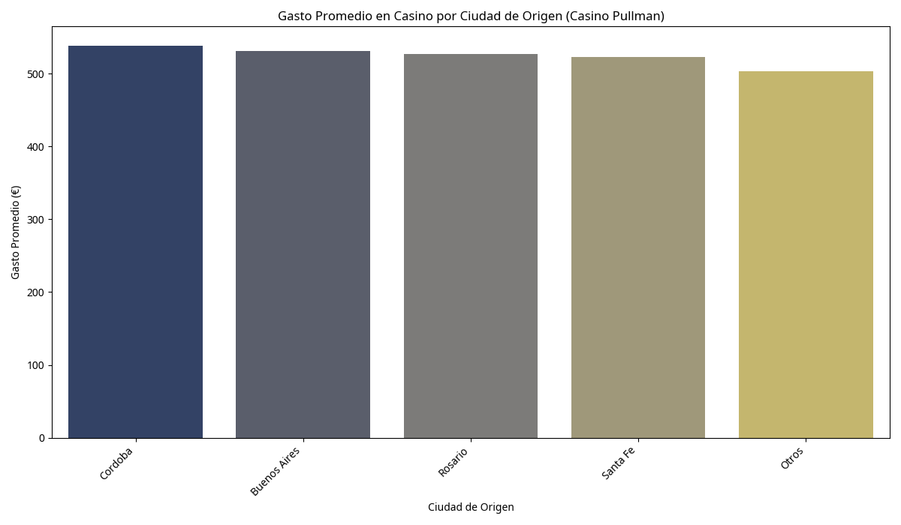

# 🎰 Business Intelligence para Casino Pullman Rosario: Análisis de Operaciones Hoteleras y Gaming

## 🎯 Objetivo del Proyecto

Este proyecto de Business Intelligence se centra en el análisis integral del **Casino Pullman de Rosario**, Argentina, específicamente en la explotación hotelera del complejo conocido como City Center. El objetivo es optimizar las operaciones tanto del casino como del hotel, maximizar los ingresos y entender mejor el comportamiento de los clientes a través de storytelling con datos.

## 📊 Datasets Utilizados (Simulados)

Se han generado datasets simulados que representan:
- **Operaciones Hoteleras**: Ocupación diaria, ingresos del hotel y número de huéspedes registrados.
- **Ingresos del Casino**: Ingresos brutos y ganancia neta por tipo de juego (Tragamonedas, Ruleta, Blackjack, Poker).
- **Demografía de Clientes**: Edad, género, ciudad de origen, frecuencia de visitas y gasto promedio en el casino.

## 📈 Análisis y Visualizaciones Clave

### 🏨 Operaciones Hoteleras

#### Tendencia Mensual de Ocupación Hotelera

Gráfico de líneas que muestra la evolución de la ocupación hotelera promedio a lo largo del año, identificando patrones estacionales y oportunidades de mejora.

#### Ingresos Hoteleros Mensuales

Gráfico de barras que detalla los ingresos totales del hotel por mes, permitiendo identificar los períodos de mayor rentabilidad.

### 🎲 Análisis de Ingresos del Casino

#### Ingresos Brutos por Tipo de Juego

Visualización que muestra qué juegos generan más ingresos brutos, fundamental para la estrategia de gaming y la asignación de recursos.

#### Ganancia Neta Mensual del Casino

Tendencia de la ganancia neta mensual del casino, crucial para entender la rentabilidad y planificar estrategias futuras.

### 👥 Análisis de Demografía de Clientes

#### Distribución de Edades de Clientes

Histograma que muestra la distribución de edades de los clientes, útil para segmentación y marketing dirigido.

#### Gasto Promedio por Ciudad de Origen

Análisis del gasto promedio en el casino según la ciudad de origen de los clientes, identificando mercados clave y oportunidades de expansión.

## 🛠️ Tecnologías Utilizadas

- **Python**: Lenguaje principal para el análisis de datos y Business Intelligence.
- **Pandas**: Manipulación y análisis de datos estructurados.
- **Matplotlib & Seaborn**: Creación de visualizaciones profesionales para reportes ejecutivos.

## 💡 Insights Clave para Reclutadores

- **Business Intelligence**: Demuestra capacidad para transformar datos operativos en insights estratégicos para la toma de decisiones ejecutivas.
- **Análisis de Gaming**: Competencia específica en el análisis de datos de casinos, incluyendo métricas de rentabilidad por juego y comportamiento del cliente.
- **Storytelling con Datos**: Habilidad para crear narrativas convincentes a partir de datos complejos, esencial para presentaciones a stakeholders.
- **Segmentación de Clientes**: Experiencia en análisis demográfico y comportamental para optimizar estrategias de marketing y retención.
- **Revenue Optimization**: Capacidad para identificar oportunidades de mejora en ingresos tanto en operaciones hoteleras como de gaming.
- **Análisis Multisectorial**: Experiencia en el análisis de datos para industrias de entretenimiento y hospitalidad.

## 🏛️ Contexto Histórico: Casino Pullman Rosario

El Casino Pullman de Rosario es un ícono de entretenimiento en Argentina, ubicado en el corazón de la ciudad de Rosario. El complejo City Center representa la evolución del entretenimiento y la hospitalidad en la región, combinando gaming de clase mundial con servicios hoteleros de alta calidad.

Este proyecto demuestra cómo el análisis de datos puede ser aplicado para optimizar operaciones complejas en la industria del entretenimiento, maximizando tanto la experiencia del cliente como la rentabilidad del negocio.

