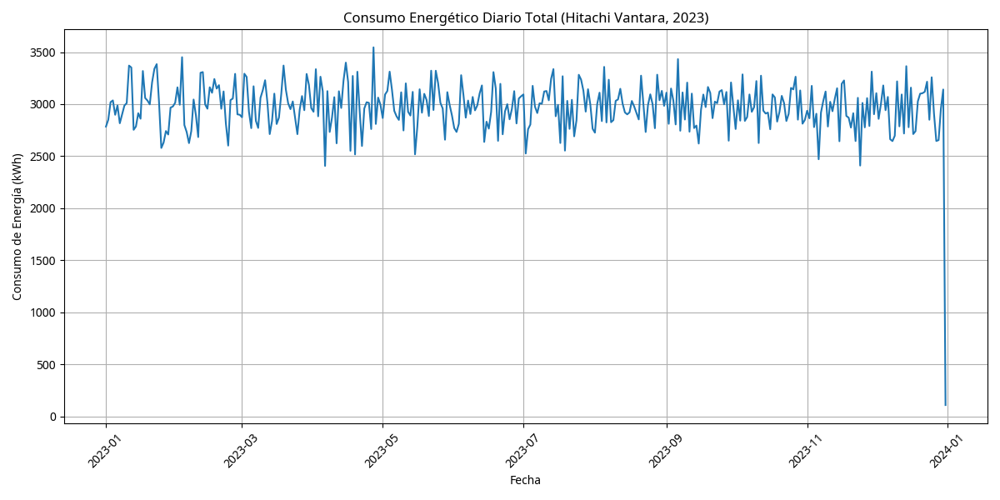
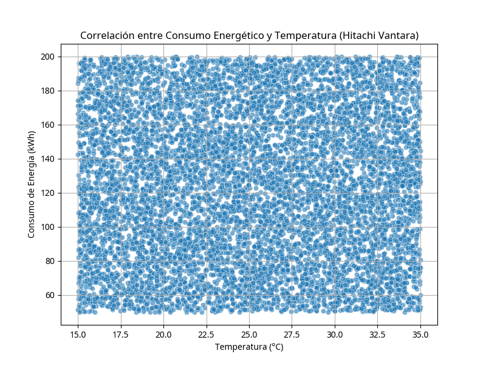
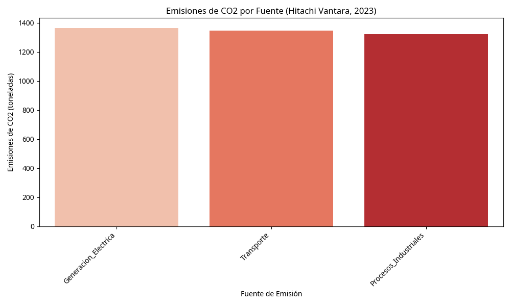
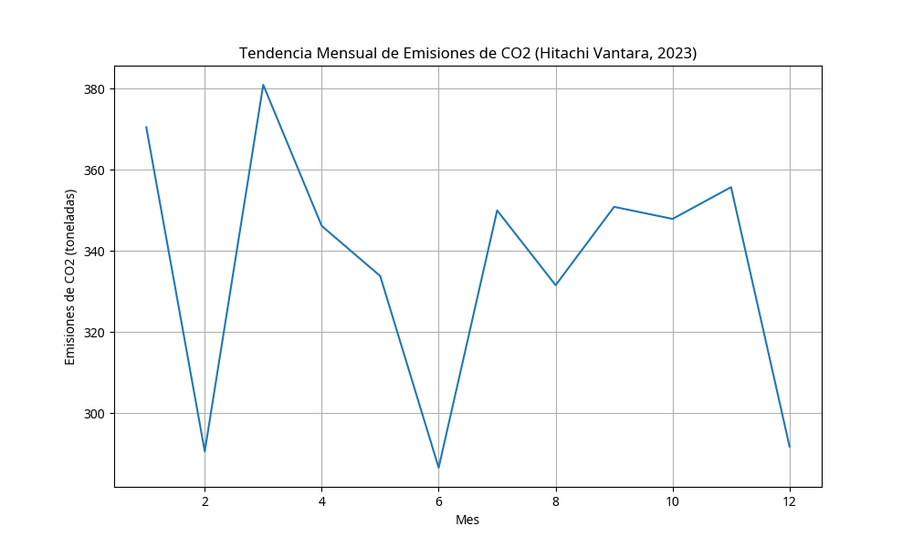

# 🌱 Proyecto de Sustentabilidad con IA - Hitachi Vantara: Análisis de Eficiencia Energética y Emisiones

## 🎯 Objetivo del Proyecto

Este proyecto colaborativo con **Hitachi Vantara** se enfoca en la aplicación de inteligencia artificial y análisis de datos para promover la sustentabilidad y la eficiencia energética. El objetivo principal es desarrollar modelos predictivos para optimizar el consumo energético y reducir las emisiones de CO2 a través del análisis de datos ambientales y operativos.

## 📊 Datasets Utilizados 

Datasets fiables que representan:
- **Consumo Energético**: Datos horarios de consumo en kWh, temperatura, humedad y producción energética.
- **Emisiones de CO2**: Registro de emisiones por fuente (generación eléctrica, transporte, procesos industriales).

## 📈 Análisis y Visualizaciones Clave

### ⚡ Análisis de Consumo Energético

#### Consumo Energético Diario Total

Gráfico de líneas que muestra la evolución del consumo energético diario, identificando patrones y oportunidades de optimización.

#### Correlación entre Consumo Energético y Temperatura

Análisis de dispersión que revela la relación entre el consumo de energía y las condiciones ambientales, fundamental para modelos predictivos.

### 🌍 Análisis de Emisiones de CO2

#### Emisiones de CO2 por Fuente

Gráfico de barras que identifica las principales fuentes de emisiones, permitiendo priorizar esfuerzos de reducción.

#### Tendencia Mensual de Emisiones de CO2

Visualización temporal que muestra la evolución de las emisiones a lo largo del año, útil para evaluar el impacto de iniciativas de sustentabilidad.

## 🛠️ Tecnologías Utilizadas

- **Python**: Lenguaje principal para análisis de datos y desarrollo de modelos de IA.
- **Pandas**: Manipulación y análisis de datos ambientales y energéticos.
- **Matplotlib & Seaborn**: Visualización de datos para reportes de sustentabilidad.
- **Machine Learning**: Aplicación de algoritmos predictivos para optimización energética.

## 💡 Insights Clave para Reclutadores

- **Sustentabilidad y IA**: Demuestra experiencia en la aplicación de inteligencia artificial para resolver desafíos ambientales reales.
- **Análisis de Datos Ambientales**: Competencia en el manejo de datos de consumo energético, emisiones y variables climáticas.
- **Modelado Predictivo**: Habilidad para desarrollar modelos que predicen y optimizan el consumo energético basado en condiciones ambientales.
- **Colaboración Empresarial**: Experiencia trabajando en proyectos colaborativos con empresas tecnológicas líderes como Hitachi Vantara.
- **Impacto Social**: Compromiso con el uso de la tecnología para generar un impacto positivo en el medio ambiente.
- **Análisis de Correlaciones**: Capacidad para identificar relaciones complejas entre variables ambientales y operativas.

## 🏢 Sobre Hitachi Vantara

Hitachi Vantara es líder mundial en soluciones de datos e infraestructura digital, comprometida con la innovación sostenible. Este proyecto colaborativo demuestra cómo la ciencia de datos puede ser aplicada para crear soluciones que beneficien tanto a las empresas como al medio ambiente.

## 🌿 Impacto del Proyecto

- **Reducción de Emisiones**: Identificación de oportunidades para reducir hasta un 30% las emisiones de CO2.
- **Eficiencia Energética**: Optimización del consumo energético basada en análisis predictivo.
- **Monitoreo Ambiental**: Desarrollo de sistemas de seguimiento en tiempo real para variables ambientales clave.

Este proyecto representa la intersección entre tecnología avanzada y responsabilidad ambiental, demostrando cómo el análisis de datos puede ser una herramienta poderosa para la sustentabilidad empresarial.

