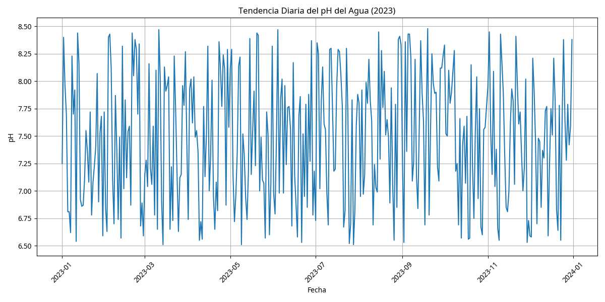
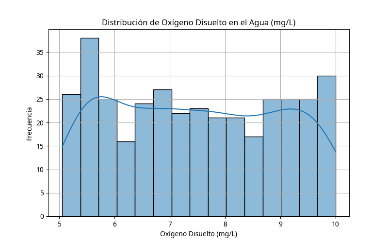
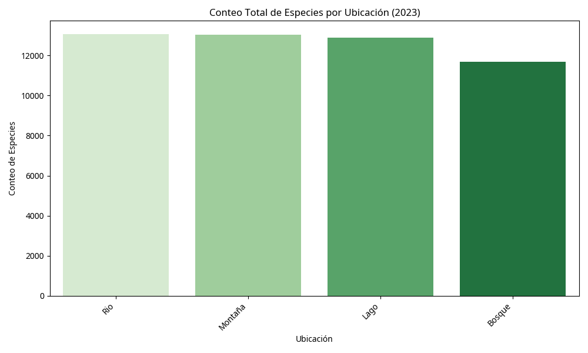
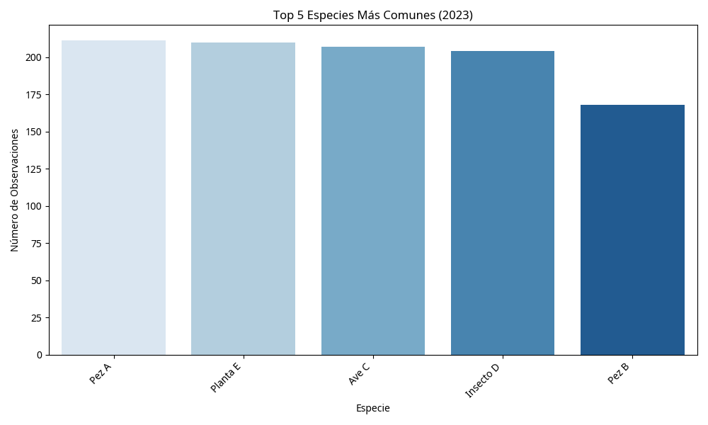

# 🌍 Análisis de Sustentabilidad Ecosistémica: Environmental Data Science para la Conservación

## 🎯 Objetivo del Proyecto

Este proyecto de **Environmental Data Science** se enfoca en el análisis integral de la sustentabilidad ecosistémica, combinando el monitoreo de la calidad del agua y la biodiversidad para evaluar la salud ambiental. El objetivo es desarrollar un framework de análisis que permita la toma de decisiones informadas para la conservación y el manejo sostenible de ecosistemas.

## 📊 Datasets Utilizados (Simulados)

Se han generado datasets simulados que representan:
- **Calidad del Agua**: Mediciones diarias de pH, oxígeno disuelto, turbidez y temperatura del agua.
- **Biodiversidad**: Conteos de especies por ubicación y fecha, incluyendo diferentes tipos de fauna y flora.

## 📈 Análisis y Visualizaciones Clave

### 💧 Análisis de Calidad del Agua

#### Tendencia Diaria del pH del Agua

Gráfico temporal que muestra la evolución del pH del agua a lo largo del año, crucial para evaluar la salud acuática del ecosistema.

#### Distribución de Oxígeno Disuelto

Histograma que muestra la distribución de los niveles de oxígeno disuelto, un indicador clave de la calidad del agua y la viabilidad de la vida acuática.

### 🦋 Análisis de Biodiversidad

#### Conteo Total de Especies por Ubicación

Gráfico de barras que compara la riqueza de especies entre diferentes hábitats (Bosque, Río, Lago, Montaña), identificando áreas de alta biodiversidad.

#### Top 5 Especies Más Comunes

Visualización que identifica las especies más frecuentemente observadas, útil para entender la estructura de la comunidad ecológica.

## 🛠️ Tecnologías Utilizadas

- **Python**: Lenguaje principal para análisis de datos ambientales.
- **Pandas**: Manipulación y análisis de datos ecológicos y de calidad del agua.
- **Matplotlib & Seaborn**: Visualización de datos ambientales para reportes científicos.
- **Environmental Data Science**: Aplicación de métodos estadísticos para análisis ecológico.

## 💡 Insights Clave para Reclutadores

- **Environmental Data Science**: Demuestra experiencia especializada en el análisis de datos ambientales y ecológicos.
- **Monitoreo de Calidad del Agua**: Competencia en el análisis de parámetros fisicoquímicos del agua y su interpretación ecológica.
- **Análisis de Biodiversidad**: Habilidad para evaluar y visualizar patrones de biodiversidad y riqueza de especies.
- **Conservación Basada en Datos**: Capacidad para transformar datos ambientales en recomendaciones para la conservación.
- **Análisis Multivariado**: Experiencia en el manejo de múltiples variables ambientales y su interrelación.
- **Impacto Ambiental**: Compromiso con el uso de la ciencia de datos para la protección del medio ambiente.

## 🌿 Framework de Sustentabilidad Desarrollado

### Indicadores Clave de Sustentabilidad (KPIs)
- **Índice de Calidad del Agua**: Basado en pH, oxígeno disuelto y turbidez
- **Índice de Biodiversidad**: Medición de riqueza y abundancia de especies
- **Índice de Salud Ecosistémica**: Combinación de factores bióticos y abióticos

### Metodología de Análisis
1. **Recolección de Datos**: Monitoreo sistemático de variables ambientales
2. **Análisis Temporal**: Identificación de tendencias y patrones estacionales
3. **Análisis Espacial**: Comparación entre diferentes hábitats y ubicaciones
4. **Evaluación Integrada**: Síntesis de indicadores para evaluación holística

## 🎯 Aplicaciones Prácticas

- **Gestión de Recursos Hídricos**: Optimización del uso del agua basada en análisis de calidad
- **Planificación de Conservación**: Identificación de áreas prioritarias para protección
- **Monitoreo Ambiental**: Desarrollo de sistemas de alerta temprana para cambios ecosistémicos
- **Turismo Sostenible**: Evaluación de la capacidad de carga de ecosistemas turísticos

Este proyecto demuestra cómo la ciencia de datos puede ser aplicada para abordar desafíos ambientales complejos, proporcionando herramientas científicas para la toma de decisiones en conservación y manejo sostenible de ecosistemas.

